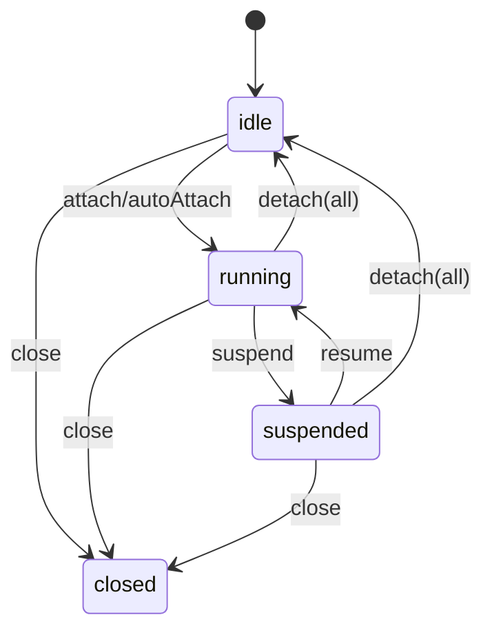

# audio-inspect API Specification

Status: Draft (vNext)
Audience: library users & maintainers
Language target: TypeScript-first, JavaScript compatible
Platforms: Browser (WebAudio), Node.js (offline). Realtime is WebAudio only.

> This spec prioritizes low cognitive load, WebAudio conventions,
> composability, and performance-friendly defaults.

---

## 0. Goals / Non-goals

### Goals

- Make offline analysis simple with low performance footguns.
- Make realtime monitoring composable in existing WebAudio graphs.
- Support both pull (`read`) and push (`onFrame`) for UI and streaming use.
- Allow internal intermediate sharing (FFT, windows, frames) across multiple features.
- Keep one mental model across worklet-capable and non-worklet runtimes.
- Keep extensibility safe for future feature/provider additions.

### Non-goals

- Audio editing, effects processing, or DAW-class functionality.
- Mandatory streaming/container-level partial decode in vNext.
- Sample-accurate realtime timestamp guarantees across all environments.

---

## 1. Primary Real-World Use Cases

### Offline

1. One-shot analysis from file/URL.
2. Decode once, analyze many times.
3. Batch analysis with progress and continue-on-error.
4. Range analysis (intro/chorus/segment only).
5. Use with existing `AudioBuffer`/PCM pipelines.

### Realtime (WebAudio)

6. Mic meter UI (RMS/Peak/LUFS/VAD) via rAF pull.
7. Tap existing node graphs without rewiring output paths.
8. Dynamically add/remove features from UI.
9. Integrate cleanly with Tone.js and other WebAudio wrappers.
10. Run under worklet when available, fallback when not.

---

## 2. Mental Model

### Offline

- `load(source) -> AudioData` (decode/convert)
- `analyze(audioData, request) -> results` (compute)
- `inspect(source, request)` as one-shot convenience (`load + analyze`)

### Realtime

- `monitor({ context, features, ... }) -> session`
- Connect graph to `session.node` (or use `session.attach(source)`)
- UI uses `session.read()` (pull) or `session.onFrame()` (push)
- Dynamic feature changes via `setFeature/removeFeature/setFeatures`
- `close()` releases resources (caller owns `AudioContext`)

---

## 3. Package Entrypoints

### Root export (recommended)

```ts
export {
  FEATURES,
  load,
  analyze,
  inspect,
  monitor,
  prepareWorklet,
  AudioInspectError,
  isAudioInspectError
} from 'audio-inspect';
```

### Optional subpath exports (advanced)

- `audio-inspect/features/*`: pure feature functions
- `audio-inspect/core`: low-level frame processors

Subpath exports are optional from a packaging perspective.

---

## 4. Core Types

### 4.1 AudioData (canonical internal format)

```ts
export interface AudioData {
  sampleRate: number;
  channelData: Float32Array[]; // planar
  numberOfChannels: number;
  length: number;              // samples per channel
  duration: number;            // seconds
}
```

### 4.2 AudioSource / AudioLike

```ts
export type AudioLike = AudioData | AudioBuffer;

export type AudioSource =
  | AudioLike
  | ArrayBuffer
  | ArrayBufferView
  | Blob
  | File
  | URL
  | string;
```

`string` interpretation:

- Browser: URL string.
- Node.js: file path string.

Use `new URL(...)` when explicit URL semantics are needed in Node.js.

### 4.3 TimeRange

```ts
export interface TimeRange {
  start?: number; // seconds, default 0
  end?: number;   // seconds, default audio.duration
}
```

### 4.4 ChannelSelector

```ts
export type ChannelSelector =
  | 'mix'                // default: downmix to mono
  | number               // specific channel index
  | 'all'                // all channels
  | readonly number[];   // selected channels
```

When channel selection is multi-channel (`'all'` or `number[]`), result shapes are feature-specific and documented per feature type.

---

## 5. Feature Model

### 5.1 Feature Registry (TypeScript)

```ts
export interface FeatureRegistry {
  rms: { options: RMSOptions; result: RMSResult };
  peak: { options: PeakOptions; result: PeakResult };
  peaks: { options: PeaksOptions; result: PeaksResult };
  waveform: { options: WaveformOptions; result: WaveformResult };

  zeroCrossing: { options: ZeroCrossingOptions; result: ZeroCrossingResult };
  energy: { options: EnergyOptions; result: EnergyResult };

  fft: { options: FFTOptions; result: FFTResult };
  spectrum: { options: SpectrumOptions; result: SpectrumResult };

  spectralFeatures: { options: SpectralFeaturesOptions; result: SpectralFeaturesResult };
  timeVaryingSpectralFeatures: {
    options: TimeVaryingSpectralOptions;
    result: TimeVaryingSpectralResult;
  };

  spectralEntropy: { options: SpectralEntropyOptions; result: SpectralEntropyResult };
  spectralCrest: { options: SpectralCrestOptions; result: SpectralCrestResult };

  mfcc: { options: MFCCOptions; result: MFCCResult };
  mfccWithDelta: { options: MFCCWithDeltaOptions; result: MFCCWithDeltaResult };

  lufs: { options: LUFSOptions; result: LUFSResult };
  vad: { options: VADOptions; result: VADResult };

  crestFactor: { options: CrestFactorOptions; result: CrestFactorResult };

  stereo: { options: StereoOptions; result: StereoResult };
  timeVaryingStereo: { options: TimeVaryingStereoOptions; result: TimeVaryingStereoResult };
}

export type FeatureId = keyof FeatureRegistry & string;

export type FeatureOptions<K extends FeatureId> =
  FeatureRegistry[K]['options'];

export type FeatureResult<K extends FeatureId> =
  FeatureRegistry[K]['result'];

export type FeatureSelection<T extends FeatureId = FeatureId> = {
  [K in T]?: FeatureOptions<K> | true; // true = default options
};

export type FeatureInput<T extends FeatureId = FeatureId> =
  | FeatureSelection<T>
  | readonly T[];

export type SelectedFeatureIds<F> =
  F extends readonly (infer I)[]
    ? Extract<I, FeatureId>
    : Extract<keyof F, FeatureId>;
```

`FeatureInput` allows both object and array shorthand. `SelectedFeatureIds<F>` derives a precise feature union from either form.
Type inference examples in this spec assume TypeScript 5.0+ (`const` type parameters). For older TS versions, callers may need `as const` / `satisfies`.

### 5.2 FEATURES

```ts
export const FEATURES: readonly FeatureId[];
```

Order is stable. New features are additive (minor).

---

## 6. Offline Decode API (`load`)

### 6.1 Purpose

Decode finite sources into `AudioData`.

### 6.2 Signature

```ts
export interface AudioDecoder {
  /** Human-readable backend name for diagnostics */
  name: string;
  decode(
    input: ArrayBuffer | ArrayBufferView | Blob,
    options?: { signal?: AbortSignal }
  ): Promise<AudioData>;
}

export interface LoadOptions {
  sampleRate?: number;
  channels?: number | 'mono' | 'stereo';
  normalize?: boolean;
  signal?: AbortSignal;

  fetch?: (input: RequestInfo | URL, init?: RequestInit) => Promise<Response>;

  /**
   * Decode backend override.
   * Browser: optional (built-in WebAudio decoder is default).
   * Node.js: required for compressed/container inputs unless source is already AudioData.
   */
  decoder?: AudioDecoder;
}

export async function load(
  source: AudioSource,
  options?: LoadOptions
): Promise<AudioData>;
```

### 6.3 Behavior (normative)

- `AudioData` input:
  - no options: return same reference (no copy).
  - with options: apply conversion and return new `AudioData`.
- `AudioBuffer` input:
  - no conversion needed: implementation SHOULD reuse channel buffers where possible.
  - conversion needed: implementation MAY allocate new buffers.
- Runtime decoder behavior:
  - Browser: implementation SHOULD provide a default decoder based on WebAudio.
  - Node.js: implementation MUST require an injected decoder for sources that need decoding.
  - If Node.js decode is required and `decoder` is missing, throw `DECODE_BACKEND_MISSING`.
- `normalize` means peak normalization to max abs amplitude `1.0`.
- `signal` abort throws `AudioInspectError` code `ABORTED`.

### 6.4 Errors

| Condition | Code |
|---|---|
| Unsupported input type | `INVALID_INPUT` |
| Fetch failure | `NETWORK_ERROR` |
| Decode failure | `DECODE_ERROR` |
| Decode backend not configured (Node.js) | `DECODE_BACKEND_MISSING` |
| Unsupported format/codec | `UNSUPPORTED_FORMAT` |
| Aborted | `ABORTED` |

### 6.5 Runtime Matrix (normative)

| Input Source | Browser | Node.js | Notes |
|---|---|---|---|
| `AudioData` | Supported | Supported | No decoder required. |
| `AudioBuffer` | Supported | Supported (if available) | No decoder required. |
| `ArrayBuffer` / `ArrayBufferView` | Supported (default decoder) | Supported with injected `decoder` | Raw bytes must be decodable by backend. |
| `Blob` / `File` | Supported | Supported with injected `decoder` | In Node.js, `File` availability depends on runtime/polyfill. |
| `URL` | Supported (`fetch` + decode) | Supported (`fetch` + injected `decoder`) | `fetch` can be overridden via `LoadOptions.fetch`. |
| `string` | Treated as URL | Treated as file path | Node.js file-path decode requires injected `decoder`. |

Rules:

- Node.js support in this spec is offline-only and decoder-injected for compressed/container sources.
- Implementations SHOULD include actionable install/setup hints in `DECODE_BACKEND_MISSING` errors.

---

## 7. Offline Analysis API (`analyze` / `inspect`)

### 7.1 `analyze` (decoded-input-first)

#### Signature

```ts
export interface AnalyzeRequest<F extends FeatureInput = FeatureInput> {
  features: F;
  range?: TimeRange;
  continueOnError?: boolean; // default false
  onProgress?: (event: AnalyzeProgressEvent<SelectedFeatureIds<F>>) => void;
  signal?: AbortSignal;
}

export interface AnalyzeProgressEvent<T extends FeatureId = FeatureId> {
  phase: 'feature';
  completed: number;
  total: number;
  feature: T;
}

export interface AnalyzeResult<T extends FeatureId = FeatureId> {
  meta: {
    sampleRate: number;
    channels: number;
    duration: number;
    length: number;
    range: Required<TimeRange>;
    totalElapsedMs: number;
  };
  results: Partial<{ [K in T]: FeatureResult<K> }>;
  errors: Partial<Record<T, AudioInspectError>>;
}

export async function analyze<const F extends FeatureInput>(
  audio: AudioLike,
  request: AnalyzeRequest<F>
): Promise<AnalyzeResult<SelectedFeatureIds<F>>>;
```

#### Behavior

- `audio` accepts `AudioData` or `AudioBuffer`.
- `continueOnError=false`: throw first failure.
- `continueOnError=true`: collect per-feature errors and continue.
- `onProgress` fires once per feature after success/failure.
- `signal` abort throws `ABORTED`.
- Implementations SHOULD avoid unnecessary copies for `range` slicing (use views when possible).

### 7.2 `inspect` (one-shot convenience)

#### Signature

```ts
export interface InspectRequest<F extends FeatureInput = FeatureInput>
  extends Omit<AnalyzeRequest<F>, 'signal'> {
  load?: LoadOptions;
  signal?: AbortSignal; // applies to load + analyze
}

export type InspectResult<T extends FeatureId = FeatureId> = AnalyzeResult<T> & {
  meta: AnalyzeResult<T>['meta'] & {
    loadElapsedMs: number;
  };
};

export async function inspect<const F extends FeatureInput>(
  source: AudioSource,
  request: InspectRequest<F>
): Promise<InspectResult<SelectedFeatureIds<F>>>;
```

Use `inspect` for one-shot ergonomics; use `load + analyze` for repeated analysis.

---

## 8. Realtime Monitoring API (`monitor`)

### 8.1 Design Notes (normative)

- Single top-level realtime API for both engines.
- Support both pull and push delivery.
- Push is frame-level (one callback per frame), not per-feature.
- `MonitorSession<T>` treats `T` as the initial/specified feature snapshot; dynamic updates are runtime behavior.

### 8.2 Worklet preload (`prepareWorklet`)

```ts
export interface PrepareWorkletOptions {
  moduleUrl?: string;
}

export async function prepareWorklet(
  context: BaseAudioContext,
  options?: PrepareWorkletOptions
): Promise<void>;
```

Rules:

- Idempotent per `context + moduleUrl`.
- Optional optimization. `monitor()` may auto-load internally when needed.
- Not required for `engine: 'main-thread'`.

### 8.3 Signatures

```ts
export type MonitorEngine = 'worklet' | 'main-thread';
export type MonitorEngineMode = 'auto' | MonitorEngine;

export type MonitorSource =
  | AudioNode
  | MediaStream
  | HTMLMediaElement;

export type MonitorState = 'idle' | 'running' | 'suspended' | 'closed';

export interface MonitorOptions<F extends FeatureInput = FeatureInput> {
  context: BaseAudioContext;
  features: F;

  source?: MonitorSource;
  autoAttach?: boolean; // default true when source provided

  engine?: MonitorEngineMode; // default 'auto'
  fallback?: 'main-thread' | 'error'; // default 'main-thread' when engine='auto'

  worklet?: {
    moduleUrl?: string;
  };

  bufferSize?: number;        // default 1024
  hopSize?: number;           // default 512
  inputChannelCount?: number; // default 1

  output?: 'none' | 'destination' | AudioNode;

  emit?: 'hop' | 'raf' | number;
}

export interface MonitorFrame<T extends FeatureId = FeatureId> {
  /**
   * Timestamp in seconds, aligned to BaseAudioContext.currentTime semantics.
   * When coalescing (`emit: 'raf' | number`) this is the last completed frame time.
   */
  timestamp: number;
  results: Partial<{ [K in T]: FeatureResult<K> }>;
}

export interface MonitorErrorEvent {
  code: string;
  message: string;
  cause?: unknown;
  recoverable?: boolean;
}

export interface MonitorSession<T extends FeatureId = FeatureId> {
  readonly state: MonitorState;
  readonly engine: MonitorEngine;
  readonly features: ReadonlySet<FeatureId>;

  /**
   * Tap/pass-through capable AudioNode endpoint.
   * Typical tap usage:
   *   someNode.connect(session.node)
   * and no extra destination routing is required by the monitor itself.
   */
  readonly node: AudioNode;

  // Feature updates are enqueue-based.
  // Await is optional for UI usage; Promise is for deterministic sequencing/tests.
  setFeature<K extends FeatureId>(
    feature: K,
    options?: FeatureOptions<K> | true
  ): Promise<void>;

  removeFeature(feature: FeatureId): Promise<void>;

  setFeatures<K extends FeatureId>(
    features: FeatureSelection<K>
  ): Promise<void>;

  // Pull API
  read(): MonitorFrame<T> | null;

  readFeature<K extends FeatureId>(feature: K): FeatureResult<K> | undefined;

  // Push API
  onFrame(handler: (frame: MonitorFrame<T>) => void): () => void;

  onError(handler: (event: MonitorErrorEvent) => void): () => void;

  // Graph integration
  attach(source: MonitorSource): void;
  detach(source?: MonitorSource): void;

  // Lifecycle
  suspend(): Promise<void>;
  resume(): Promise<void>;
  close(): Promise<void>;
}

export async function monitor<const F extends FeatureInput>(
  options: MonitorOptions<F>
): Promise<MonitorSession<SelectedFeatureIds<F>>>;
```

### 8.4 Runtime Semantics (normative)

- `engine: 'auto'`: try worklet, then apply `fallback` policy.
- `engine: 'worklet'`: strict mode; fail if unavailable/load fails.
- `engine: 'main-thread'`: never attempts worklet load.
- Implementations SHOULD keep analysis graph liveness internally (e.g. silent keep-alive route) so tap/attach works without forcing user output rewiring.
- `emit` delivery policy:
  - `'hop'`: every analysis hop.
  - `'raf'`: coalesced to animation frame cadence.
  - `number`: coalesced to max Hz.

`output` policy applies only to internally created source nodes (`MediaStream`/`HTMLMediaElement`):

- `HTMLMediaElement` default: `'destination'`.
- `MediaStream` default: `'none'`.
- `AudioNode` source: caller controls graph routing.

Realtime buffer ownership:

- `MonitorFrame.results` may reuse internal TypedArray/object buffers between frames.
- Callers must copy values if long-term retention is needed.

`HTMLMediaElement` integration note:

- Some runtimes restrict media-element source node creation to one per element/context.
- If that constraint is hit, callers should pass an already-created `AudioNode` source instead.

### 8.5 Lifecycle Rules



Rules:

- `read/onFrame` produce new data only while `running`.
- `close()` is terminal and idempotent.
- After `close()`, `attach/resume/setFeature/removeFeature/setFeatures` fail with `INVALID_STATE`.

---

## 9. Feature Catalog (contract-level)

This section defines API-level contracts; algorithmic details are implementation-specific and tracked in changelog.

### Common option conventions

- `channel?: ChannelSelector` (default `'mix'`)
- `asDB?: boolean` (default `false`)
- `reference?: number` (default `1.0`)
- `fftSize?: number` (power-of-two)
- `windowFunction?: 'hann' | 'hamming' | 'blackman' | 'rect' | ...`
- Frame params use samples (`frameSize`, `hopSize`), with `*Ms` suffix only when ms units are used.

### Built-in feature IDs

- Time: `rms`, `peak`, `peaks`, `waveform`, `zeroCrossing`, `energy`
- Frequency: `fft`, `spectrum`
- Spectral: `spectralFeatures`, `timeVaryingSpectralFeatures`, `spectralEntropy`, `spectralCrest`
- Speech/ML: `mfcc`, `mfccWithDelta`, `vad`
- Loudness: `lufs`
- Dynamics: `crestFactor`
- Stereo: `stereo`, `timeVaryingStereo`

If a feature is unsupported under a specific engine/runtime, implementations must return `AudioInspectError` with `UNSUPPORTED_FORMAT` or another appropriate code.

---

## 10. Error Model

All public failures are `AudioInspectError`.

```ts
export class AudioInspectError extends Error {
  code: string;
  details?: unknown;
  cause?: unknown;
}

export function isAudioInspectError(value: unknown): value is AudioInspectError;
```

Minimum codes (normative):

- `INVALID_INPUT`
- `INVALID_STATE`
- `UNSUPPORTED_FORMAT`
- `DECODE_ERROR`
- `DECODE_BACKEND_MISSING`
- `NETWORK_ERROR`
- `PROCESSING_ERROR`
- `INITIALIZATION_FAILED`
- `WORKLET_NOT_SUPPORTED`
- `MODULE_LOAD_FAILED`
- `INSUFFICIENT_DATA`
- `MEMORY_ERROR`
- `ABORTED`

---

## 11. Defaults (normative)

Offline:

- `continueOnError: false`
- `range: { start: 0, end: audio.duration }`
- Decode backend defaults:
  - Browser: built-in WebAudio decoder.
  - Node.js: no default compressed-audio decoder (inject `LoadOptions.decoder` when decode is needed).

Realtime:

- `engine: 'auto'`
- `fallback: 'main-thread'`
- `bufferSize: 1024`
- `hopSize: 512`
- `inputChannelCount: 1`
- `emit: 'hop'`
- `output` defaults:
  - `HTMLMediaElement`: `'destination'`
  - `MediaStream`: `'none'`
  - `AudioNode`: caller-managed

---

## 12. Usage Examples

### 12.1 One-shot (load + analyze)

```ts
import { inspect } from 'audio-inspect';

const { results } = await inspect('audio.mp3', {
  load: { normalize: true, sampleRate: 48000 },
  features: { rms: { asDB: true }, spectrum: { fftSize: 2048 } }
});

console.log(results.rms, results.spectrum);
```

### 12.2 Decode once, analyze many

```ts
import { load, analyze } from 'audio-inspect';

const audio = await load(file);

const a = await analyze(audio, { features: { rms: true, peak: true } });
const b = await analyze(audio, { features: { mfcc: { numMfccCoeffs: 13 } } });
```

### 12.3 Range analysis

```ts
const result = await analyze(audio, {
  range: { start: 0, end: 30 },
  features: { lufs: true, spectralFeatures: true }
});
```

### 12.4 Realtime UI (pull + rAF)

```ts
import { monitor } from 'audio-inspect';

const session = await monitor({
  context: audioContext,
  source: micStream,
  features: { rms: { asDB: true }, peak: { asDB: true } },
  emit: 'raf'
});

function loop() {
  const frame = session.read();
  if (frame) {
    renderMeters(frame.results.rms, frame.results.peak);
  }
  requestAnimationFrame(loop);
}

loop();
```

### 12.5 Realtime stream (push)

```ts
session.onFrame((frame) => {
  updateUI(frame.timestamp, frame.results);
});
```

### 12.6 Tap existing AudioNode graph

```ts
const session = await monitor({
  context: audioContext,
  features: { spectrum: { fftSize: 2048 } }
});

someNode.connect(session.node);

session.onFrame(({ results }) => {
  drawSpectrum(results.spectrum);
});
```

### 12.7 HTMLMediaElement convenience

```ts
const session = await monitor({
  context: audioContext,
  source: audioElement,
  features: { rms: true }
  // default output for HTMLMediaElement is 'destination'
});
```

---

## 13. Versioning Policy

- Removing/renaming `FeatureId`, changing result shapes, or changing monitor contracts is semver-major.
- Adding feature IDs is semver-minor.
- Numeric behavior/default algorithm changes must be documented in changelog.
- Changing realtime default behavior (`engine`, `fallback`, `emit`, output policy) is semver-major.
